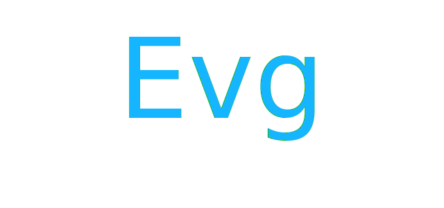

# gampleman/evg

Elm Vector Graphics

> The API is a bit wonky
>
> -- [elm/svg](https://package.elm-lang.org/packages/elm/svg/latest/)

This is a WIP vector graphics library. It aims to have significantly better DX than similar Elm libraries (i.e. not a _wonky API_) while maintaining appropriate type safety and maintaining the expressivity of the underlying SVG.

Let's look at some example comparisons.

### Programming with shapes


**elm/svg:**

```elm
import Svg
import Svg.Attribute

grid : Float -> { width : Float, height : Float } -> Svg msg
grid lineEveryPx dims =
    let
        xCount =
            floor (dims.height / lineEveryPx)

        yCount =
            floor (dims.width / lineEveryPx)
    in
    Svg.g []
        [ List.range 0 xCount
            |> List.map
                (\i ->
                    Svg.line
                        [ Svg.Attribute.x1 "0"
                        , Svg.Attribute.y1 (String.fromFloat (toFloat i * lineEveryPx))
                        , Svg.Attribute.x2 (String.fromFloat dims.width)
                        , Scg.Attribute.y2 (String.fromFloat (toFloat i * lineEveryPx))
                        ]
                        []
                )
        , List.range 0 yCount
            |> List.map
                (\i ->
                    Svg.line
                        [ Svg.Attribute.x1 (String.fromFloat (toFloat i * lineEveryPx))
                        , Svg.Attribute.y1 "0"
                        , Svg.Attribute.x2 (String.fromFloat (toFloat i * lineEveryPx))
                        , Scg.Attribute.y2 (String.fromFloat dims.height)
                        ]
                        []
                )
        ]
```

Note all the manual stringification of all the numeric attributes. Also note the verbosity of defining a simple line.

**elm-community/typed-svg:**

```elm
import Color
import TypedSvg
import TypedSvg.Attributes
import TypedSvg.Attributes.InPx
import TypedSvg.Core exposing (Svg)
import TypedSvg.Types


grid : Float -> { width : Float, height : Float } -> Svg msg
grid lineEveryPx dims =
    let
        xCount =
            floor (dims.height / lineEveryPx)

        yCount =
            floor (dims.width / lineEveryPx)
    in
    TypedSvg.g []
        [ List.range 0 xCount
            |> List.map
                (\i ->
                    TypedSvg.line
                        [ TypedSvg.Attributes.InPx.x1 0
                        , TypedSvg.Attributes.InPx.y1 (toFloat i * lineEveryPx)
                        , TypedSvg.Attributes.InPx.x2 dims.width
                        , TypedSvg.Attributes.InPx.y2 (toFloat i * lineEveryPx)
                        , TypedSvg.Attributes.stroke (TypedSvg.Types.Paint Color.black)
                        ]
                        []
                )
            |> TypedSvg.g []
        , List.range 0 yCount
            |> List.map
                (\i ->
                    TypedSvg.line
                        [ TypedSvg.Attributes.InPx.x1 (toFloat i * lineEveryPx)
                        , TypedSvg.Attributes.InPx.y1 0
                        , TypedSvg.Attributes.InPx.x2 (toFloat i * lineEveryPx)
                        , TypedSvg.Attributes.InPx.y2 dims.height
                        , TypedSvg.Attributes.stroke (TypedSvg.Types.Paint Color.black)
                        ]
                        []
                )
            |> TypedSvg.g []
        ]


```

The stringification is gone, but verbosity has actually increased. Also note that there is now somewhat excessive "type safety" going on with defining the stroke (and we need 2 extra imports just to define it). Now granted, we can reduce the verbosity somewhat by more clever import aliasing and/or exposing, but than it becomes a problem each programmer has to solve. And even though theoretically type safety has increased, there are still important holes, such as the possibility of defining lines without specifying their endpoints.

**gampleman/evg:**

```elm
import Evg exposing (Evg)

grid : Float -> Evg { context | width : Float, height : Float } msg
grid lineEveryPx =
    Evg.withContext (\dims ->
        let
            xCount =
                floor (dims.height / lineEveryPx)

            yCount =
                floor (dims.width / lineEveryPx)
        in
        Evg.group [] [
            List.range 0 xCount
                |> List.map
                    (\i ->
                        Evg.line [] (0, toFloat i * lineEveryPx) (dims.width, toFloat i * lineEveryPx)
                    )
                |> Evg.group []
            , List.range 0 yCount
                |> List.map
                    (\i ->
                        Evg.line [] (toFloat i * lineEveryPx, 0) (toFloat i * lineEveryPx, dims.height)
                    )
                |> Evg.group []
        ]
    )
```

Note how here the code is significantly shorter. We achieve this by:

1. Lines have required arguments that are passed positionally, so no need for lengthy attribute lists and greater safety - it's impossible to pass the wrong attributes (anyone ever forget weather lines take `x0`, `x` or `x1`?)
2. Most elements (except groups) don't take meaningful children (with some exceptions we'll get into), so we don't waste space on empty lists of children in our API.
3. Sensible defaults - lines will default to a black stroke if you don't specify anything, since no one loves scratching their head why can't they see anything.

Finally, this example also illustrates one of our compositional primitives - the ability to define context that allows a way to pass information globally throughout an entire rendering. This allows passsing information to leaf functions without needing to change intermediate functions just to pass information down.

### Programming paths

> [!NOTE]
> This would benefit from a shorter example, since this gets bogged down in a fair amount of geometry.
> But that's how it often goes in graphics programming...


<details>
    <summary>Some auxiliary geometry code</summary>

I've factored this out to make the following example a bit easier on the eyes, but in real life I would often include it inline:

```elm
module GeometryHelpers exposing (..)

type alias Point =
    ( Float, Float )

polarToCartesian : Point -> Float -> Float -> Point
polarToCartesian (cx, cy) angle r =
    ( cx + radius * cos angle
    , cy + radius * sin angle
    )

regularPolygonAngle : Int -> Float
regularPolygonAngle sides =
    2 * pi / toFloat n

len : Point -> Point -> Float
len ( x1, y1 ) ( x2,  y2 ) =
            sqrt ((x2 - x1) ^ 2 + (y2 - y1) ^ 2)

interpolateLine : Float -> Point -> Point -> Point
interpolateLine t ( x1, y1) ( x2,  y2 ) =
            ( (1 - t) * x1 + t * x2, (1 - t) * y1 + t * y2 )


roundedPolygonPoints : Float -> List Point -> List ( Float, Point, Point )
roundedPolygonPoints cornerRadius points =
    let
        shift l =
            List.drop l (List.Extra.cycle (n + l) points)

    in
    List.map3
        (\( x1, y1 ) ( x2, y2 ) ( x3, y3 ) ->
            let
                l1 =
                    len x1 y1 x2 y2

                l2 =
                    len x2 y2 x3 y3

                r =
                    min cornerRadius (min l1 l2 / 2)

                angle =
                    pi + (atan2 (x3 - x2) (y3 - y2) - atan2 (x2 - x1) (y2 - y1))

                offset =
                    abs (r / tan (angle / 2))

                ( midX, midY ) =
                    pointOnLine ((l1 - offset) / l1) x1 y1 x2 y2

                ( endX, endY ) =
                    pointOnLine (offset / l2) x2 y2 x3 y3
            in
            ( r
            , ( midX, midY)
            , ( endX, endY )
            )
        )
        points
        (shift 1)
        (shift 2)

```

</details>

```elm
import List.Extra
import Svg exposing (Svg)
import Svg.Attributes


roundedPolygon : List (Svg.Attribute msg) -> Maybe Float -> List ( Float, Float ) -> Svg msg
roundedPolygon attrs cornerRadius points =
    let
        roundedPoints =
            GeometryHelpers.roundedPolygonPoints
                (Maybe.withDefault 0 cornerRadius)
                points

        move =
            List.reverse roundedPoints
                |> List.head
                |> Maybe.map (\( _, _, ( x, y ) ) -> "M" ++ String.fromFloat x ++ " " ++ String.fromFloat y)
                |> Maybe.withDefault "M0,0"

        path =
            roundedPoints
                |>  List.map
                (\( r, ( midX, midY ), ( endX, endY ) ) ->
                    "L"
                        ++ String.fromFloat midX
                        ++ " "
                        ++ String.fromFloat midY
                        ++ " A"
                        ++ String.fromFloat r
                        ++ " "
                        ++ String.fromFloat r
                        ++ " 0 0 1 "
                        ++ String.fromFloat endX
                        ++ " "
                        ++ String.fromFloat endY
                )
                |> String.join " "
    in
    Svg.path (Svg.Attributes.d (move ++ path ++ "Z") :: attrs) []


ngon :
    List (Svg.Attribute msg)
    ->
        { sides : Int
        , circumference : Float
        , cx : Float
        , cy : Float
        , cornerRadius : Maybe Float
        }
    -> Svg msg
ngon attrs args =
    let
        sides =
            max 3 args.sides

        angle =
            GeometryHelpers.regularPolygonAngle sides

        radius =
            max 0 args.circumference

        points =
            List.range 1 sides
                |> List.map (\index ->
                    GeometryHelpers.polarToCartesian
                        (args.cx, args.cy)
                        (toFloat index * angle)
                        radius
                    )
    in
    roundedPolygon attrs args.cornerRadius points


main =
    Svg.svg [ Svg.Attributes.viewBox "0 0 300 100" ]
        [ ngon [ Svg.Attributes.fill "limegreen" ]
            { sides = 3
            , circumference = 60
            , cx = 50
            , cy = 50
            , cornerRadius = Just 10
            }
        , ngon [ Svg.Attributes.fill "palevioletred" ]
            { sides = 5
            , circumference = 50
            , cx = 150
            , cy = 50
            , cornerRadius = Nothing
            }
        , ngon [ Svg.Attributes.fill "royalblue" ]
            { sides = 7
            , circumference = 48
            , cx = 250
            , cy = 50
            , cornerRadius = Just 20
            }
        ]

```

(I'll omit a TypedSvg example here since it's not meaningfully different).

```elm
import List.Extra
import Evg exposing (Evg)
import Evg.Attribute exposing (Supported)
import Evg.Path exposing (Path(..))


cornerRadius : Float -> Evg.Attribute { a | cornerRadius : Supported } msg
cornerRadius =
    Attr.floatAttr "cornerRadius"

roundedPolygon : List (Evg.Attribute { a | cornerRadius : Supported } msg) -> List ( Float, Float ) -> Evg c msg
roundedPolygon attrs points =
    let
        radius =
            Evg.Attribute.getFloat "cornerRadius" 0 attrs

        path =
            points
                |> GeometryHelpers.roundedPolygonPoints radius
                |> List.concatMap (\(r, mid, end) ->
                    [ L mid , A r r 0 0 1 end ]
                )

        lastPoint =
            M (0, 0) els
                |> Evg.Path.endPoint

    in
    Evg.path attrs (M lastPoint path |> Evg.Path.close)


ngon : List (Evg.Attribute { a | cornerRadius : Supported } msg) -> { sides : Int, circumference : Float , center : ( Float , Float ) } -> Evg c msg
ngon attrs args =
    let
        sides =
            max 3 args.sides

        angle =
            GeometryHelpers.regularPolygonAngle sides

        radius =
            max 0 args.circumference

        points =
            List.range 1 sides
                |> List.map (\index ->
                    GeometryHelpers.polarToCartesian
                        args.center
                        (toFloat index * angle)
                        radius
                    )
    in
    roundedPolygon attrs points


main =
    Evg.svg [] { width = 300, height = 100 }
        [ ngon [ Evg.fillStr "limegreen", cornerRadius 10 ]
            { sides = 3
            , circumference = 60
            , center = ( 50, 50 )
            }
        , ngon [ Evg.fillStr "palevioletred" ]
            { sides = 5
            , circumference = 50
            , center = ( 150, 50 )

            }
        , ngon [ Evg.fillStr "royalblue", cornerRadius 20 ]
            { sides = 7
            , circumference = 48
            , center = ( 250, 50 )
            }
        ]

```

### Filters



(Credit to Dirk Weber at Smashing Magazine for the original image this is based on)

**elm/svg:**

```elm
import List.Extra
import Svg exposing (Svg)
import Svg.Attributes


filter : Svg msg
filter =
    Svg.filter
        [ Svg.Attributes.id "my-filter" -- better hope that's unique
        , Svg.Attributes.width "150%"
        , Svg.Attributes.height "160%"
        , Svg.Attributes.x "-25%"
        , Svg.Attributes.y "-25%"
        ]
        [ -- colors
          Svg.feFlood [ Svg.Attributes.floodColor "#16B5FF", Svg.Attributes.result "COLOR-blue" ] []
        , Svg.feFlood [ Svg.Attributes.floodColor "#9800FF", Svg.Attributes.result "COLOR-violet" ] []
        , Svg.feFlood [ Svg.Attributes.floodColor "#A64DFF", Svg.Attributes.result "COLOR-violet-light" ]
            []

        -- BOTTOM SPLASH
        , Svg.feTurbulence
            [ Svg.Attributes.baseFrequency "0.05"
            , Svg.Attributes.type_ "fractalNoise"
            , Svg.Attributes.numOctaves "1"
            , Svg.Attributes.seed "1"
            , Svg.Attributes.result "BOTTOM-SPLASH_10"
            ]
            []
        , Svg.feGaussianBlur
            [ Svg.Attributes.stdDeviation "6.5"
            , Svg.Attributes.in_ "SourceAlpha"
            , Svg.Attributes.result "BOTTOM-SPLASH_20"
            ]
            []
        , Svg.feDisplacementMap
            [ Svg.Attributes.scale "420"
            , Svg.Attributes.in_ "BOTTOM-SPLASH_20"
            , Svg.Attributes.in2 "BOTTOM-SPLASH_10"
            , Svg.Attributes.result "BOTTOM-SPLASH_30"
            ]
            []
        , Svg.feComposite
            [ Svg.Attributes.operator "in"
            , Svg.Attributes.in_ "COLOR-blue"
            , Svg.Attributes.in2 "BOTTOM-SPLASH_30"
            , Svg.Attributes.result "BOTTOM-SPLASH_40"
            ]
            []
        , -- MIDDLE SPLASH
          Svg.feTurbulence
            [ Svg.Attributes.baseFrequency "0.1"
            , Svg.Attributes.type_ "fractalNoise"
            , Svg.Attributes.numOctaves "1"
            , Svg.Attributes.seed "1"
            , Svg.Attributes.result "MIDDLE-SPLASH_10"
            ]
            []
        , Svg.feGaussianBlur
            [ Svg.Attributes.in_ "SourceAlpha"
            , Svg.Attributes.stdDeviation "0.1"
            , Svg.Attributes.result "MIDDLE-SPLASH_20"
            ]
            []
        , Svg.feDisplacementMap
            [ Svg.Attributes.in_ "MIDDLE-SPLASH_20"
            , Svg.Attributes.in2 "MIDDLE-SPLASH_10"
            , Svg.Attributes.scale "25"
            , Svg.Attributes.result "MIDDLE-SPLASH_30"
            ]
            []
        , Svg.feComposite
            [ Svg.Attributes.in_ "COLOR-violet-light"
            , Svg.Attributes.in2 "MIDDLE-SPLASH_30"
            , Svg.Attributes.operator "in"
            , Svg.Attributes.result "MIDDLE-SPLASH_40"
            ]
            []
        , -- TOP SPLASH
          Svg.feTurbulence
            [ Svg.Attributes.baseFrequency "0.07"
            , Svg.Attributes.type_ "fractalNoise"
            , Svg.Attributes.numOctaves "1"
            , Svg.Attributes.seed "1"
            , Svg.Attributes.result "TOP-SPLASH_10"
            ]
            []
        , Svg.feGaussianBlur
            [ Svg.Attributes.stdDeviation "3.5"
            , Svg.Attributes.in_ "SourceAlpha"
            , Svg.Attributes.result "TOP-SPLASH_20"
            ]
            []
        , Svg.feDisplacementMap
            [ Svg.Attributes.scale "220"
            , Svg.Attributes.in_ "TOP-SPLASH_20"
            , Svg.Attributes.in2 "TOP-SPLASH_10"
            , Svg.Attributes.result "TOP-SPLASH_30"
            ]
            []
        , Svg.feComposite
            [ Svg.Attributes.operator "in"
            , Svg.Attributes.in_ "COLOR-violet"
            , Svg.Attributes.in2 "TOP-SPLASH_30"
            , Svg.Attributes.result "TOP-SPLASH_40"
            ]
            []
        , -- LIGHT EFFECTS
          Svg.feMerge [ Svg.Attributes.result "LIGHT-EFFECTS_10" ]
            [ Svg.feMergeNode [ Svg.Attributes.in_ "BOTTOM-SPLASH_40" ] []
            , Svg.feMergeNode [ Svg.Attributes.in_ "MIDDLE-SPLASH_40" ] []
            , Svg.feMergeNode [ Svg.Attributes.in_ "TOP-SPLASH_40" ] []
            ]
        , Svg.feColorMatrix
            [ Svg.Attributes.type_ "matrix"
            , Svg.Attributes.values "0 0 0 0 0, 0 0 0 0 0, 0 0 0 0 0, 0 0 0 1 0"
            , Svg.Attributes.in_ "LIGHT-EFFECTS_10"
            , Svg.Attributes.result "LIGHT-EFFECTS_20"
            ]
            []
        , Svg.feGaussianBlur
            [ Svg.Attributes.stdDeviation "2"
            , Svg.Attributes.in_ "LIGHT-EFFECTS_20"
            , Svg.Attributes.result "LIGHT-EFFECTS_30"
            ]
            []
        , Svg.feSpecularLighting
            [ Svg.Attributes.surfaceScale "5"
            , Svg.Attributes.specularConstant ".75"
            , Svg.Attributes.specularExponent "30"
            , Svg.Attributes.lightingColor "#white"
            , Svg.Attributes.in_ "LIGHT-EFFECTS_30"
            , Svg.Attributes.result "LIGHT-EFFECTS_40"
            ]
            [ Svg.fePointLight
                [ Svg.Attributes.x "-50"
                , Svg.Attributes.y "-100"
                , Svg.Attributes.z "400"
                ]
                []
            ]
        , Svg.feComposite
            [ Svg.Attributes.operator "in"
            , Svg.Attributes.in_ "LIGHT-EFFECTS_40"
            , Svg.Attributes.in2 "LIGHT-EFFECTS_20"
            , Svg.Attributes.result "LIGHT-EFFECTS_50"
            ]
            []
        , Svg.feComposite
            [ Svg.Attributes.operator "arithmetic"
            , Svg.Attributes.k1 "0"
            , Svg.Attributes.k2 "1"
            , Svg.Attributes.k3 "1"
            , Svg.Attributes.k4 "0"
            , Svg.Attributes.in_ "LIGHT-EFFECTS_10"
            , Svg.Attributes.in2 "LIGHT-EFFECTS_50"
            , Svg.Attributes.result "LIGHT-EFFECTS_60"
            ]
            []
        ]


main =
    Svg.svg [ Svg.Attributes.viewBox "0 0 640 300" ]
        [ Svg.defs []
            [ filter
            ]
        , Svg.text_
            [ Svg.Attributes.fontSize "160px"
            , Svg.Attributes.x "320"
            , Svg.Attributes.y "170"
            , Svg.Attributes.textAnchor "middle"
            , Svg.Attributes.fill "#16B5FF"
            , Svg.Attributes.filter "url(#my-filter)"
            ]
            [ Svg.text "Evg" ]
        ]

```

Can you honestly claim you understand what is going on here?

**gampleman/evg:**

```elm
import Evg
import Evg.Paint as Paint
import Evg.Filter as Filter


splashText : Evg.TextPosition -> String -> Evg c msg
splashText  =
    let
        bottomSplash =
            Filter.sourceAlpha
                |> Filter.gaussianBlur 6.5
                |> Filter.displacementMap [] { scale = 420 }
                    (Filter.fractalNoise { baseFrequency = 0.05, numOctaves = 1, seed = 1 })
                |> Filter.compositeIn (Filter.floodStr "#16B5FF")


        middleSplash =
            Filter.sourceAlpha
                |> Filter.gaussianBlur 0.1
                |> Filter.displacementMap [] { scale = 25 }
                    (Filter.fractalNoise { baseFrequency = 0.1, numOctaves = 1, seed = 1 })
                |> Filter.compositeIn (Filter.floodStr "#A64DFF")


        topSplash =
             Filter.sourceAlpha
                |> Filter.gaussianBlur 3.5
                |> Filter.displacementMap [] { scale = 220 }
                    (Filter.fractalNoise { baseFrequency = 0.07, numOctaves = 1, seed = 1 })
                |> Filter.compositeIn (Filter.floodStr "#9800FF")


        base =
            Filter.merge [ bottomSplash, middleSplash, topSplash ]

        shifted =
            base
                |> Filter.colorMatrix [[0 0 0 0 0], [0 0 0 0 0], [0 0 0 0 0], [0 0 0 1 0]]

        lit =
            shifted
                |> Filter.gaussianBlur 2
                |> Filter.specularLighting
                    { surfaceScale = 5
                    , specularConstant = 0.75
                    , specularExponent = 30
                    , lightingColor = "white"
                    , light = Filter.pointLight { x = -50,  y = -100, z = 400 }
                    }


        filter =
            Filter.compositeIn lit shifted
                |> Filter.compositeArithmetic 0 1 1 0 base
    in
    Evg.text
        [ Evg.fillStr "#16B5FF"
        , Evg.fontFamily "'Racing Sans One', cursive"
        , Evg.fontSize 160
        , Evg.filter
            [ Filter.relativeRect { x = -0.25, y = -0.25, width = 1.5, height = 1.6} ]
            filter
        ]


main =
    Evg.svg [] { width = 640, height = 300 }
        [ splashText { x = 320, y = 170, anchor = Evg.Middle } "Evg" ]
```

Note how much easier the logic of the filter is to read, since the control flow of how the pixels are processed looks much more like normal Elm code.
In some ways this is reasonable, since filters are more naturally expressed as a function composition. The SVG syntax is an XML serialization of such a composition and having then an Elm API directly ape that serialization format rather than the original functional composition is rather silly.

The other thing to note is that the code is quite error prone - it relies on a whole bunch of string IDs to be manually passed around. If you misspell any of them, then your filter will stop working and you get no explanation why.

Finally, this whole thing is terrible for composition. If you add another filter from a library/another module than simply by them changing an ID in their code, they can break the filter in your code, since the filter IDs can be the same.

Also note that in our code we can then start easily refactoring:

```elm
splashText : Evg.TextPosition -> String -> Evg c msg
splashText  =
    let
        splash { blur, frequency, color, scale } =
            Filter.sourceAlpha
                |> Filter.gaussianBlur blue
                |> Filter.displacementMap [] { scale = scale }
                    (Filter.fractalNoise { baseFrequency = frequency, numOctaves = 1, seed = 1 })
                |> Filter.compositeIn (Filter.floodStr color)

        base =
            Filter.merge
                [ splash { blur = 6.5, color = "#16B5FF", frequency = 0.05, scale = 420 }
                , splash { blur = 0.1, color = "#A64DFF", frequency = 0.10, scale =  25 }
                , splash { blur = 3.5, color = "#9800FF", frequency = 0.07, scale = 220 }
                ]
```

This allows us to easily compose and work on our filters, without needing to worry about having the proper IDs in place, but also enables easier creative freedom (for instance adding another splash layer would be trivial in the above code, but rather painful in the _elm/svg_ version).

### Animation

SVG can be animated (amongst other standard web tech ways) with a declarative language called SMIL. SMIL based animation is fairly powerful, but manually coding it can be extremely tedious and for many kinds of animations it can be quite a counterintuitive way to animate. In Elm, SMIL also has the benefit that it doesn't require sending any messages (as it is fully declarative), so it can be very useful for various small composable animations.


Unfortunately, the API leaves something to be desired:

```elm
import Svg
import Svg.Attribute

pulseRect : Svg msg
pulseRect =
    Svg.rect
        [ Svg.Attributes.rx "30"
        , Svg.Attributes.fill "navy"
        , Svg.Attributes.x "10"
        , Svg.Attributes.y "10"
        , Svg.Attributes.width "100"
        , Svg.Attributes.height "100"
        ]
        [ Svg.animate
            [ Svg.Attributes.attributeName "rx"
            , Svg.Attributes.values "30; 50; 20; 30"
            , Svg.Attributes.begin "0s"
            , Svg.Attributes.dur "3s"
            , Svg.Attributes.keyTimes "0; 0.2; 0.6; 1"
            , Svg.Attributes.calcMode "spline"
            , Svg.Attributes.repeatCount "indefinite"
            , Svg.Attributes.keySplines "0 0 1 1; .5 0 .5 1; 0 0 1 1"
            ]
            []
        ]
```

Our simplest fix is simply to turn the API from a columnar design to row oriented design:

```elm
import Evg
import Evg.Animate

pulseRect : Evg c msg
pulseRect =
    Evg.rect [ Evg.cornerRadius 0 ]
        { x = 10, y = 10, width = 100, height = 100 }
        |> Evg.Animate.easedAttributeKeyframes [ Evg.Animate.repeatIndefinite ] Evg.cornerRadius
            [ ( 0.8, Evg.Animate.easeLinear, 50 )
            , ( 1.8, Evg.Animate.easeInOut, 20 )
            , ( 3.0, Evg.Animate.easeLinear, 30 )
            ]
```

The code is notably shorther, but it also allows us to understand easily how each keyframe works, by seeing the value, the time and the easing function that produced it next to each other. We also use some clever defaults here to set the initial value to the value of the element (you can override this if necessary).

However, even this API can be quite low-level for practical animations. We offer a slightly higher-level version:

```elm
import Evg
import Evg.Color
import Evg.Animate

pulseCircle : Evg c msg
pulseCircle =
    Evg.Animate.keyframes [ Evg.Animate.repeatIndefinite, Evg.Animate.easing Evg.Animate.easeInOut ]
        [ ( 0.0, Evg.circle [ Evg.fill (Evg.Color.rgb 20 60 20)] { r = 10, center = ( 50, 50 ) } )
        , ( 0.6, Evg.circle [ Evg.fill (Evg.Color.rgb 20 180 20)] { r = 40, center = ( 50, 50 ) } )
        , ( 1.1, Evg.circle [ Evg.fill (Evg.Color.rgb 150 180 20)] { r = 40, center = ( 150, 50 ) } )
        , ( 1.5, Evg.circle [ Evg.fill (Evg.Color.rgb 20 60 20)] { r = 10, center = ( 150, 50 ) } )
        , ( 2.0, Evg.circle [ Evg.fill (Evg.Color.rgb 20 60 20)] { r = 10, center = ( 50, 50 ) } )
        ]
```

This allows us to define an animation at a much higher level. It wil be turned roughly into the following:

```elm
import Svg
import Svg.Attribute

pulseCircle : Svg msg
pulseCircle =
    Svg.circle
        [ Svg.Attributes.r "10"
        , Svg.Attributes.fill "rgb(20,60,20)"
        , Svg.Attributes.cx "50"
        , Svg.Attributes.cy "50"
        ]
        [ Svg.animate
            [ Svg.Attributes.attributeName "r"
            , Svg.Attributes.values "10; 40; 10; 10"
            , Svg.Attributes.begin "0s"
            , Svg.Attributes.dur "2s"
            , Svg.Attributes.keyTimes "0; 0.3; 0.75; 1"
            , Svg.Attributes.calcMode "spline"
            , Svg.Attributes.repeatCount "indefinite"
            , Svg.Attributes.keySplines ".5 0 .5 1; .5 0 .5 1; .5 0 .5 1"
            ]
            []
        , Svg.animate
            [ Svg.Attributes.attributeName "fill"
            , Svg.Attributes.values "rgb(20,60,20); rgb(20,180,20); rgb(150,180,20); rgb(20,60,20); rgb(20,60,20)"
            , Svg.Attributes.begin "0s"
            , Svg.Attributes.dur "2s"
            , Svg.Attributes.keyTimes "0; 0.3; 0.55; 0.75; 1"
            , Svg.Attributes.calcMode "spline"
            , Svg.Attributes.repeatCount "indefinite"
            , Svg.Attributes.keySplines ".5 0 .5 1; .5 0 .5 1; .5 0 .5 1; .5 0 .5 1"
            ]
            []
        , Svg.animate
            [ Svg.Attributes.attributeName "cx"
            , Svg.Attributes.values "50; 150; 50"
            , Svg.Attributes.begin "0s"
            , Svg.Attributes.dur "2s"
            , Svg.Attributes.keyTimes "0; 0.55; 1"
            , Svg.Attributes.calcMode "spline"
            , Svg.Attributes.repeatCount "indefinite"
            , Svg.Attributes.keySplines ".5 0 .5 1; .5 0 .5 1"
            ]
            []
        ]
```

As you can see, it it much easier to undersand that there are 5 distinct key frames to our animation and how the animation progresses,
as well as how to keep multiple values in synch with each other.


Finally, we also offer a sampling based API, which can be quite handy to integrate with libraries based on the idea of an interpolator:

```elm
import Evg
import Evg.Color
import Evg.Animate

progressBar : (Float -> Float) -> Evg c msg
progressBar interpolator =
    Evg.Animate.sampled [ Evg.Animate.ease Evg.Animate.easeLinear ] { samples = 6, duration = 4 }
        (\i -> Evg.rect [ Evg.fillStr "blue" ] { x = 0, y = 10, height = 10, width = interpolator i })

```

where the `i` param will go from `0` to `1` as the animation progresses. The samples parameter will dictate how many times the interpolation function will be called and therefore how many keyframes will be generated. This won't be a precise process, but I suspect with most interpolators you could get fairly good results with a fairly low sample number.

### Performance

You may be wondering what is the impact of all of this on performance? And the answer as always is: it depends. Yes, all of the above DX improvements do carry some overhead and if you are in a particularly tight loop that may matter. The good news is that ejecting from evg is fairly straightforward: click _Copy HTML_ in the dev tools, then ask Copilot to translate it back to `elm/svg` - it seems to do so flawlessly for me. That said, we provide a `Evg.Performance` module that has some tools:

- `Evg.Performance.asDef : Evg c msg -> ( Evg.Attribute msg -> Evg.Rect -> Evg c msg,  Evg.Def )` turns a complex `Evg` into an underlying symbol and an accompanying `use` element. The `use` element then can be cheaply instantiated at the provided rect. This also amortized all the DX processing, since we only do it once and then just spawn `use` which are super cheap.
- The usual `lazy` suite. Plus `lazy` versions of `asDef`.
- Ways to skip ID generation by providing manual IDs. This is (like `lazy`) a way to trade DX/correctness for an extra bit of performance juice.

### Interactivity

Interactivity in existing libraries is a mess. In an svg, when clicking (or touching) you mostly care about the coordinates of the mouse cursor relative to some element (and/or viewport). However, reliably decoding these can be extremely challenging. Library authors generally add a way to polyfill some missing things into the relevant handlers; we aim to support the same thing, making Svg event handling significantly more reliable.

Possibly we'll also support some of the native SMIL event handling primitives, such as running an animation on click.

## Final remarks

- As you can see, DX is much improved in the above examples. In order to achieve that, we need to make our APIs a tiny bit opinionated - and oriented towards typical Elm usecase such as interactive web graphics. As such, you may have noticed that there are no units to be seen anywhere. We define everything in viewspace units that are defined by the width and height of the rendering - making things somewhat responsive by default.

  In my experience this is fine for 95% of usecases, but there is always that one thing you need all the weird Svg features for. As such we provide the `Evg.Advanced` module that provides somewhat clunkier APIs, but exposes all the features of Svg. It will feel a bit more similar to typed-svg, albeit we will still do things like make some arguments required or give you access to our ID generation features.

- Evg has a number of modules, but these are not organized in the traditional Elements/Attributes/Events/Lazy style, but are more oriented around an area of graphics. That way for most drawings you should not need to import more than 2 or 3 modules.

- Accessibility: Apart from animation covered above, the main reason Svg elements take children is for accessibility related elements such a `title` or `desc`. We provide these as attributes instead, that way there is no need to waste space on a rarely used child list.

- I didn't cover some important areas above such as clipping & masking, patterns or gradients. Let's just say that if you like the filter design, these areas will work quite similarly.

## Like it? Build it!

Does the above sound good to you? Are you wondering where can you install this library and start using it? Unfortunately, it doesn't exist yet.

I put all of my API design ideas I've been thinking for the last 6 or so years into the above, but I don't really have time to go and build it. But, the ideas are free (in fact MIT licensed), so you can go build this exact library (or take what you think is good and add whatever extra).

Don't like it? Let's talk on Slack - I'd be glad to hear criticisms and improvements.
